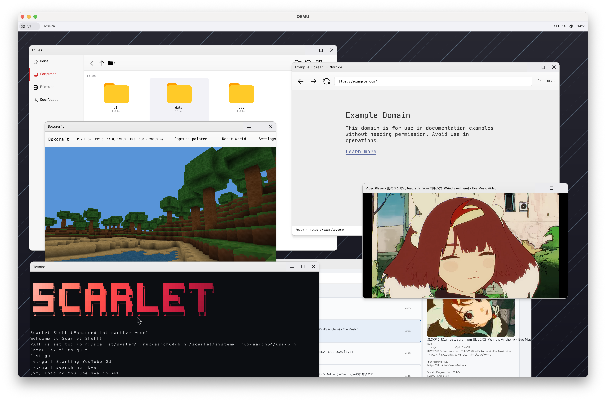
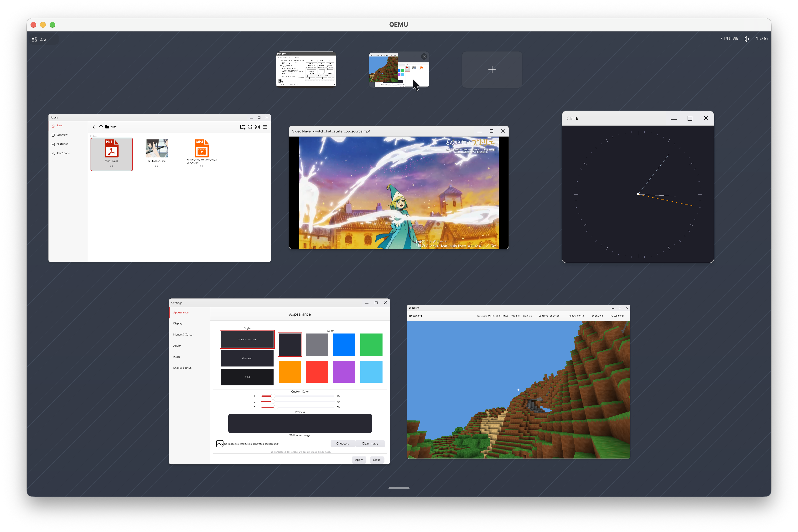
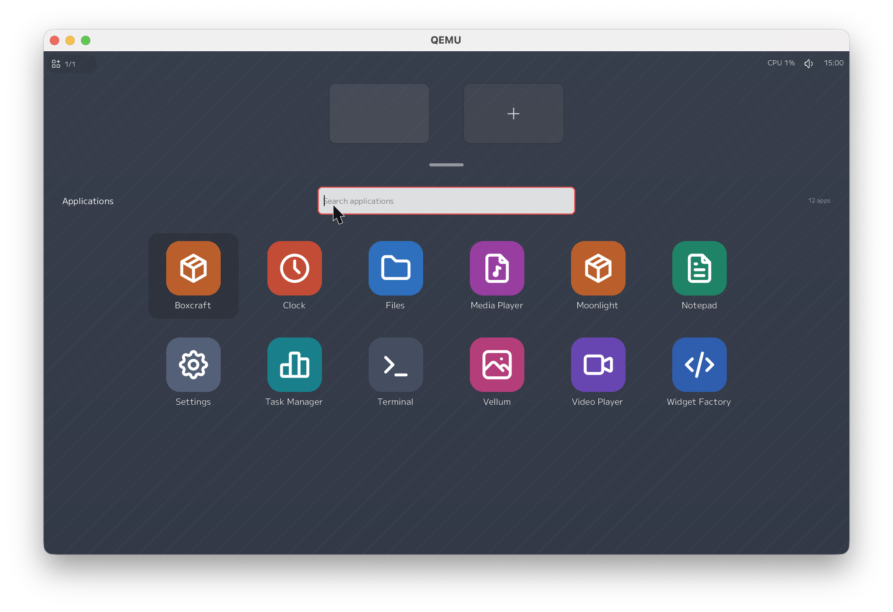

# Scarlet

<div align="center">

**A Rust operating system kernel and reference distribution for multi-ABI systems.**

[](https://github.com/petitstrawberry/Scarlet)
[](LICENSE)
[](https://riscv.org/)
[](https://www.arm.com/)
[](https://deepwiki.com/petitstrawberry/Scarlet)



</div>

## Overview

Scarlet is an operating system written primarily in Rust, combining a multi-ABI
kernel, native userland, a graphical desktop, and tooling for composing bootable
distributions.

The 1.0 release is named **Scarlet 1.0 "Akane"**.

Scarlet-native, xv6, and Linux-compatible programs share kernel services and
objects. This repository is the reference distribution, bringing together the
kernel, applications, drivers, and reusable image bundles.

## Highlights

- RISC-V 64 and AArch64 support, with [QEMU images](#quick-start) and experimental
  [real-hardware projects](#hardware-support).
- [Multi-ABI kernel](docs/abi/README.md): Scarlet-native, xv6, and partial Linux
  ABI support over shared kernel objects.
- [Desktop](#desktop): virtual desktops, an application launcher, and native
  applications using ScarletUI and SWS, with a
  [Wayland bridge](docs/graphics/wayland-bridge.md) for selected Linux GUI apps.
- [Rust applications](docs/userspace/README.md): a Scarlet Rust toolchain with
  normal Rust `std` support and native system libraries.
- [Project and distribution management](docs/architecture/distro-model.md):
  Scarlet SDK's `cargo scarlet` configures projects and composes kernels,
  modules, applications, and reusable bundles into bootable images.
  See the [tooling guide](docs/build-system/README.md).
- [SHV virtualization](docs/hypervisor/README.md): a Type-2 hypervisor with
  Scarlet-native APIs and Linux `/dev/kvm` compatibility, including
  Firecracker-class AArch64 microVM workloads.
- [Kernel services](docs/kernel/README.md): shared filesystems and namespaces,
  [networking](docs/network/architecture.md), and static or
  [loadable modules](docs/modules/lsm.md).
- [Device and media support](docs/README.md#kernel-and-device-subsystems):
  VirtIO, display presentation, audio, and video decode, with
  [codec options](user/video_player/README.md) selected by applications and bundles.

## Desktop

| Virtual desktops | Application launcher |
| :---: | :---: |
| [](docs/assets/screenshots/scarlet-virtual-desktops.png) | [](docs/assets/screenshots/scarlet-launcher.png) |
| The workspace overview shows virtual desktops and their open windows. | Open installed desktop applications from the launcher. |

## Hardware Support

Alongside the in-tree QEMU images, Scarlet has experimental support for real
hardware through standalone projects:

- [Apple Silicon](https://github.com/petitstrawberry/scarlet-project-applesilicon):
  Apple-specific BSP, drivers, and deployment tooling.
- [Qualcomm SC7180 Chromebook](https://github.com/petitstrawberry/scarlet-project-chromebook):
  Google CoachZ rev3 (Trogdor) board integration.

See each project for supported models, device coverage, and build/deployment
instructions.

## Quick Start

From the repository root, enter the Nix development shell and choose a QEMU
target:

```bash
nix develop

# Build and run the default RISC-V full image.
cargo make run-riscv64

# Or build and run the AArch64 full image.
cargo make run-aarch64
```

On desktop hosts, full images open a GL-enabled QEMU window automatically
(Cocoa with Retina on macOS; GTK or SDL on Linux). CPU emulation defaults to
TCG, and serial logs remain in the terminal. For KVM/HVF setup, headless/VNC
options, builds, and development commands, see the
[development guide](docs/development/README.md).
For physical devices, follow the relevant [hardware project](#hardware-support).

## Documentation

The [documentation index](docs/README.md) maps subsystem designs, API references,
and compatibility details. Developer entry points:

- [Development guide](docs/development/README.md): environment,
  images, runners, tests, formatting, and Rustdoc.
- [Kernel development](docs/kernel/README.md): source map, boot, memory,
  filesystems, drivers, and modules.
- [Application development](docs/userspace/README.md): Rust std/no_std libraries,
  application builds, image integration, and services.
- [Project and distribution model](docs/architecture/distro-model.md): projects,
  BSPs, bundles, image layers, and dependency locks.

## Contributing

Contributions are welcome. Please keep changes scoped, run the relevant
`cargo make` tasks before sending a PR, and update docs when changing public
interfaces, project manifests, or user-visible behavior.

## License

This project is licensed under the MIT License. See [LICENSE](LICENSE).
