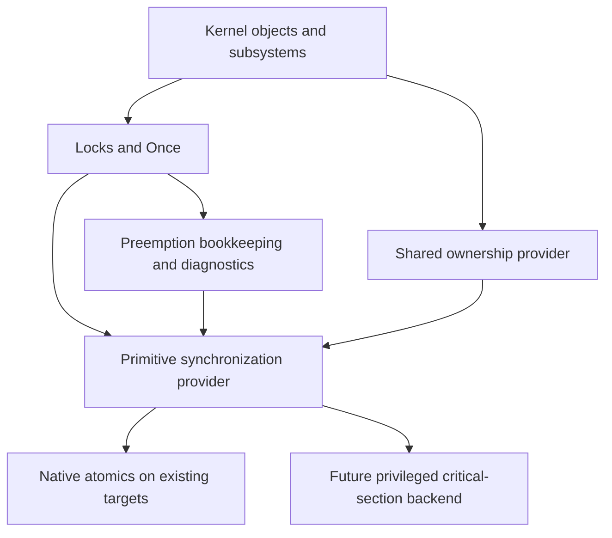

# 32-bit foundation: first implementation slice

Status: ABI representation foundation, 2026-09-08. This follows the
[initial audit](32bit-foundation-audit.md), whose findings and counts describe
source baseline `7f591dd5898e09d137ba97b0a591d6f09f97dec8`.

The first slice makes a small piece of the actual common implementation usable
under both 32-bit constraint sets. ARMv5TE and RV32 still have no Scarlet CPU
backend. The remaining audit steps, including wide syscall transport, ELF,
memory policy and synchronization implementations, remain open.

## Implemented representation boundary

The dependency-free, `no_std` [scarlet-abi crate](../../user/lib/scarlet-abi)
is now used by the kernel as well as userspace. It depends on neither allocation
nor atomics. The production modules compiled by the 32-bit checks are the same
modules used at the existing kernel's Environment boundary.

| API | Contract |
| --- | --- |
| [`AbiDataModel`](../../user/lib/scarlet-abi/src/data_model.rs) | Explicit 32/64-bit pointer/register width and byte order. This is a scalar model, not a complete calling convention. |
| `RegisterWord` | An unsigned bit pattern with explicit sign extension at the ABI width. Signed encoding rejects values that do not fit. It does not implicitly become a user pointer. |
| `UserAddress` | Checked numerical address, index/stride multiplication, addition and last-byte range bounds. Conversion to the kernel's `usize` is checked again. It conveys no VM access permission. |
| `read_u64` / `read_i64` and matching writers | Fixed-width time/file values retain all bits under either word model. Reading a signed file offset differs from interpreting one syscall word as signed. |
| Byte readers/writers | Explicit byte order, unaligned slices, checked slice offsets and lengths, no typed pointer dereferences. A failed scalar write leaves the destination unchanged. |
| [`EnvironmentExec::decode`](../../user/lib/scarlet-abi/src/environment.rs) | Size/flags validation and typed decoding of the existing native-word record. Resource limits and pointer dereferences stay in the kernel adapter. |

`AbiDataModel::NATIVE` is used only at current same-width native boundaries.
A future compatibility adapter must select its caller's model explicitly.
Register allocation, register pairs, record-specific alignment, pointer state
bits, error conventions, continuation handling and executable identity are not
inferred from the word width. No 32-bit syscall numbers or return conventions
are assigned by this change.

The Environment layouts are explicit:

| Field | 32-bit offset/width | Existing 64-bit offset/width |
| --- | --- | --- |
| `size`, `flags` | 0/4, 4/4 | 0/4, 4/4 |
| `argv` | 8/4 | 8/8 |
| `envp` | 12/4 | 16/8 |
| `cwd` | 16/4 | 24/8 |
| `handles` | 20/4 | 32/8 |
| `handle_count` | 24/4 | 40/8 |
| Size/alignment | 28/4 | 48/8 |

The 32-bit layout is a foundation contract and compile fixture, not an enabled
execution mode. Handle-transfer records remain two `u32` fields (8 bytes).

## Kernel and userspace integration

- [Environment execution](../../kernel/src/executor/syscall.rs) uses the shared
  record decoder and checked pointer-array advancement. Its mapped-memory test
  includes an unaligned record, a pointer crossing a page boundary, a record
  crossing a page boundary, invalid flags, excess handles and an unmapped tail.
- [Legacy string-array parsing](../../kernel/src/library/std/string.rs) uses
  the same word codec. Individual C-string address additions are checked.
- [User copy](../../kernel/src/library/std/usercopy.rs) rejects wrapping ranges
  before translating or copying any page. Empty copies still succeed, including
  with a null address; nonempty null copies still fail. The last representable
  byte is numerically valid. Page permissions remain the VM's responsibility.
  A later mapping failure can still leave a copied prefix; this does not make
  user copy transactional or validate allocation sizes against `isize::MAX`.
- The [scheduler attribute decoder](../../kernel/src/task/syscall.rs) validates
  the fixed-width `u64` CPU-mask pointer against the caller model before
  narrowing it. Its time fields remain `u64`.
- The task/CPU debug v1 records use explicit `u64` ID slots and 8-byte alignment.
  Sizes (64 bytes), field offsets and all existing 64-bit bytes are preserved.
  The kernel reexports the shared records instead of duplicating them. This is
  a Rust source-type change to `pid`, `tgid` and `current_task_id`; the affected
  [`top` comparison](../../user/std-bin/src/top.rs) widens its local ID instead
  of narrowing the wire ID. Other legacy task snapshots remain separate work.

This resolves the concrete Environment and debug-record issues in ABI-03/04,
and a subset of ABI-09/10/11. It does not close the whole user-copy inventory,
the other native-word snapshots, Linux marshalling or the wide-argument issues.

## Synchronization: dependency decision for the next slice

The no-CAS case cannot be solved by replacing only `AtomicU64`.
The pinned compiler exposes pointer atomics but no 64-bit atomics for
`riscv32imac-unknown-none-elf`; `armv5te-none-eabi` exposes no `target_has_atomic`
widths. The latter cannot use `alloc::sync::Arc` directly. See the
[compiler evidence and Rust references](32bit-foundation-audit.md#checks-actually-run).

Current dependencies establish the ordering constraint:

| Existing component | Dependency that blocks using it as a primitive fallback |
| --- | --- |
| [`IrqGuard`](../../kernel/src/sync/irq_guard.rs) | Requires initialized CPU identity, `PreemptGuard`, `AtomicU32::fetch_update` nesting and `AtomicUsize` saved state. |
| [`SpinLock` / `IrqSpinLock`](../../kernel/src/sync/spinlock.rs) | Uses `AtomicBool` CAS and preemption/IRQ guards, with diagnostic hooks. |
| [`Once`](../../kernel/src/sync/once.rs) | Uses `AtomicU8` CAS and contention diagnostics; an initializer interrupted by another initializer cannot make progress by spinning. |
| [`RwSpinLock`](../../kernel/src/sync/rw_spinlock.rs) | Uses pointer-width atomic state and CAS, plus preemption/diagnostic integration. |
| Shared ownership across the kernel | Existing `Arc`/`Weak` users require atomic refcounts and more than `new`/`clone`: downgrade/upgrade, cyclic construction, raw pointer conversion, pointer equality, counts and trait-object coercion/downcast. |

Introduce a primitive provider *below* preemption bookkeeping, locks and
diagnostics. The intended dependency direction is:



The primitive provider may not call `IrqGuard`, preemption-aware locks, the
allocator, scheduler, diagnostics or reference-counted objects. Early boot must
not require a published task/CPU registry. Keep the existing native atomic and
`alloc::sync::Arc` path while this seam is introduced.

The first no-CAS implementation must be explicitly **UP-only**, with a build
error for unsupported SMP. Before implementing it, the backend contract must
cover:

1. Privileged save/mask/restore of all interrupt contexts that may touch the
   protected data, including the decision about FIQ or other unmasked handlers.
   No protected data may be accessed from an excluded handler. Actual
   instructions belong to a later architecture backend.
2. A CPU-bound, non-`Send` token or closure API; nesting and exact restoration of
   prior state; boot-time availability; compiler/CPU ordering requirements.
   A closure-scoped low-level API may require lexical nesting even though the
   existing higher-level `IrqGuard` supports out-of-order guard drops.
3. No blocking, yielding, migration, allocation or arbitrary destructor calls
   inside the primitive critical section. A destructor's reference-count
   update can be protected, but final object destruction must happen after
   leaving it. Last-strong/last-weak ownership transitions need separate review.
4. Explicit semantics for acquire/release and read-modify-write operations.
   Local interrupt exclusion alone is not an SMP memory-ordering implementation
   and does not synchronize DMA or MMIO.
5. Interrupted-writer tests. A clock/diagnostic reader in an interrupt must not
   spin waiting for the writer it interrupted; use bounded snapshots, an
   unavailable result, or a representation with a justified read protocol.

Shared ownership is a separate acceptance gate. Replacing `Arc` with `Rc`, or
setting false target atomic capabilities, would not preserve `Send`/`Sync`,
weak references or trait-object behavior. Evaluate a provider against actual
kernel usage (including cyclic construction and unsizing) before choosing its
implementation. Userland needs its own OS-assisted/thread synchronization
contract; it cannot reuse privileged IRQ masking. No new refcount library or
unsafe custom `Arc` is selected in this first slice.

The next implementation unit is the provider seam with the existing native
implementation plus a test-only simulated UP critical-section backend. Its
tests must cover nested entry/restore, initialization publication, interrupted
wide reads and value destruction outside the primitive critical section, and its no-CAS common harness
must compile without `alloc::sync::Arc`. A simulated backend proves the common
contract only; it cannot prove future interrupt instructions or hardware SMP.

## Maintained verification

Run from the repository root in the Nix development shell:

```sh
cargo make test-abi-foundation
cargo make fmt-abi-check
cargo make test-riscv64
cargo make test-aarch64
```

`test-abi-foundation` runs the unchanged 7 native contract fixtures and 9 new
tests of independent 32/64-bit bytes, sign extension, upper-bit rejection,
wide time/file values, scalar write failures, address bounds and unaligned
records. It then checks the entire production `scarlet-abi` library for RV32IMAC
and bare-metal ARMv5TE with `-Z build-std=core,compiler_builtins`. These checks
do not substitute synthetic copies of production modules or introduce CPU stubs.
The task is included in CI alongside the existing release contract tests.

Results using the pinned Nix development shell (Rust 1.94.0-nightly):

| Check | Result |
| --- | --- |
| `cargo make test-abi-foundation` | 16 host tests pass; actual common library checks pass on both 32-bit targets, including the 32-bit Environment offsets and fixed debug-record layout assertions. |
| `cargo make test-riscv64` | All 1,222 tests pass in QEMU, including the mapped Environment input and both new user-copy tests. |
| `cargo make test-aarch64` | All 1,196 tests pass in QEMU, including those same new tests. |
| `cargo make fmt-check` | Exits successfully, including the newly added ABI formatting task. |
| `cargo check --locked --manifest-path user/std-bin/Cargo.toml --bin top --target riscv64gc-unknown-scarlet` | Passes with the shared fixed-width debug records. |
| Kernel `cargo test --locked --no-run --features sync-debug --target targets/<target>.json` | Both current RV64/AArch64 test binaries compile. Runtime results for this extra feature are separate from the default-feature QEMU passes above. |
