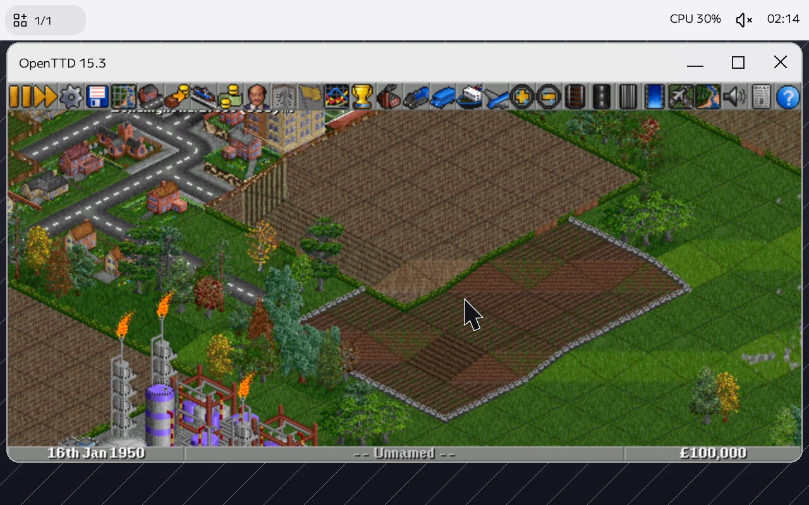

# OpenTTD through Zink on Scarlet

This is a Linux ABI application experiment. OpenTTD uses SDL2/OpenGL;
SDL Wayland/EGL reaches Mesa Zink/Kopper and `libvulkan_sgfx`, whose Scarlet
VirGL backend presents through the native Wayland bridge/SWS. The SDL2-SWS
native backend is not used in this run. ScarletUI draws the bridge's SSD.

## Fixed shared sources

| Component | Shared branch | Fixed commit | Base |
| --- | --- | --- | --- |
| Scarlet bridge/recipes | `petitstrawberry/Scarlet:codex/openttd-zink-wayland` | this branch | `10a4a4768f745e02377a4b32e96d36cad697522f` |
| SGFX | `petitstrawberry/sgfx:codex/openttd-zink-compatibility` | `8e661584a34c467745463c49069543805914fbd6` | `a1115c4201d0cdd8aa43bd29a8a9c1551d162d0a` |
| SDL2 Linux | `petitstrawberry/SDL:codex/egl-legacy-context-2.30` | `fc96e4aff56cb40b738b80674fde36291d7a98aa` | upstream `release-2.30.0` |
| Mesa | `petitstrawberry/mesa:codex/kopper-non-drm-fifo` | `a77e1dae360bd306ede96904fa9f42eb638bf406` | official GitLab `mesa-25.0.7`, `742a20f48c59e8649533c84c4d49dd95b403f5da` |
| OpenTTD | `petitstrawberry/OpenTTD:codex/gl21-compatibility` | `75b543bc25192609092e8024928f37c4af95f712` | official 15.3, `14ec60f248547d4d062a1160f0fc26d742319888` |

Mesa's GitHub fork was created through a GitHub mirror; the correction branch
was cloned from the official GitLab tag above. SDL also has the same fix on
`codex/egl-legacy-context`, based on the existing Scarlet-native SDL 2.32.10
branch. That forward-port preserves the native SWS backend but has not had a
native OpenTTD gameplay run. These branches have no PRs and do not change the
repositories' default branches.

SDL reads GL_VERSION instead of invalid pre-3.0 GL_MAJOR_VERSION. OpenTTD
accepts either VAO extension and compares GLSL 1.50's minor against 50, not 5.
Mesa has separate commits for swap interval/FIFO behavior and the opt-in
non-DRM Wayland Kopper integration (`LIBGL_KOPPER_DRI2=1`). These are maintained
as fork commits; the producers no longer apply local SDL/Mesa patch files.

The original verified official archive SHA256 values were:

- SDL 2.30.0: `36e2e41557e0fa4a1519315c0f5958a87ccb27e25c51776beb6f1239526447b0`
- Mesa 25.0.7: `592272df3cf01e85e7db300c449df5061092574d099da275d19e97ef0510f8a6`
- OpenTTD 15.3: `5ea21eea7d59c78a42071924ac18c6bc0116088f2e96b14cfee9369175973be7`
- OpenGFX 8.0: `43a0c1dabf39cb865394f3a6cc36d4da5c10ecfaaf55652043104806810903be`

OpenGFX is fetched from the official OpenTTD CDN and checked before extraction.
No base-set/game assets or runtime binaries are checked into this branch.

## Reproduce

Use an isolated checkout/output and a dedicated guest socket. On an ARM64
Docker-capable build host:

```sh
git clone --branch codex/openttd-zink-compatibility https://github.com/petitstrawberry/sgfx.git ../sgfx-zink
git -C ../sgfx-zink checkout 8e661584a34c467745463c49069543805914fbd6
tools/graphics/build-linux-vulkan.sh ../sgfx-zink
tools/graphics/build-linux-zink.sh
tools/graphics/build-linux-sdl-egl.sh
tools/graphics/build-linux-openttd.sh
```

The existing Vulkan/Zink producers install into this checkout's experimental
bundle overlay. SDL/OpenTTD produce private `artifacts/*/runtime/opt` trees;
copy them into the isolated guest image or a private guest directory. They do
not install system-wide on the host. Rebuild the native bridge with the
`wayland-decoration` feature (see its README), then start that binary against
the guest's SWS with `XDG_RUNTIME_DIR=/tmp WAYLAND_DISPLAY=wayland-zink-test`.
Start the dedicated Linux ABI process with the same socket:

```sh
XDG_RUNTIME_DIR=/tmp WAYLAND_DISPLAY=wayland-zink-test \
  abi-run linux-aarch64 /bin/sh /opt/openttd-zink/run-zink.sh
```

Set `SGFX_VULKAN_ICD` to a private ICD JSON and `SGFX_ZINK_RUNTIME` /
`SGFX_SDL_RUNTIME` to private runtime roots when testing outside `/opt`.
Their paths are Linux ABI paths. The explicit `sdl-opengl` driver fails if
initialization fails; the wrapper does not set a GL version override or force
software rendering. Independently run `zink-window-run` without arguments to
check `zink` + `SGFX` renderer, GL errors, readback and presentation, and record
the Vulkan device with the loader probe. A generic EGL software-device label
is not by itself evidence of software GL rendering; Kopper uses Vulkan WSI.

Run `/opt/sgfx-vulkan-tests/wayland-decoration` against the same bridge. Five
Enter presses advance SSD -> CSD -> SSD -> fullscreen -> restored SSD; each
stage waits for a frame callback and teardown must complete. This isolates
bridge behavior from SDL/Mesa/Vulkan. At output scale 2, the OpenTTD launcher
uses 628x300 so the toolbar and outer SSD fit the 1280x800 validation display.

## Verified behavior and remaining work

Actual ARM64 QEMU/HVF rendering identified `SGFX Vulkan (Scarlet VirGL GPU 0)`
(Vulkan API 1.0) and Zink GL 2.1 / GLSL 1.20. Pixel/readback probes passed,
OpenTTD ran 18,302 frames and cleanly exited, and the final bridge build passed
launch, map input/scrolling, move, resize, maximize/restore and close.



The final SSD run used the following binary SHA256 values:

- ICD r15: `5125b80eba72daa99299998da11cba9a6abb9995c3f6c71b6f2411425b61ab92`
- OpenTTD: `abb25050c539ef1c4570751d4f5dda6e74fa9dd4a65b85669d574a4ab72eac56`
- native bridge v7: `deb0941d9786b94812d372e798dcade482633e749beccfc026c17bd7b47a970b`

Publishing checks verified the SDL/Mesa/OpenTTD changed source bytes against
the actual tested patches, rebuilt the native bridge, and checked shell syntax.
The new fork-fetch container recipes were not rerun as a complete image/game
build. SGFX portable/programmatic/Vulkan tests passed; strict Clippy still
reports an existing codegen return-guard style lint. CI was not triggered via PR.

**OpenTTD fullscreen still fails.** Its signed viewport extends outside a
640x400 attachment (height -480), and the IR/native backend rejects it before
DEVICE_LOST. The SHM bridge fullscreen fixture passes, so fix SGFX transform
bounds/scissor validation with GPU coverage next. Capability warnings remain;
there is no complete Vulkan/Zink conformance claim. Physical hardware and
non-VirGL GPUs remain unverified.
