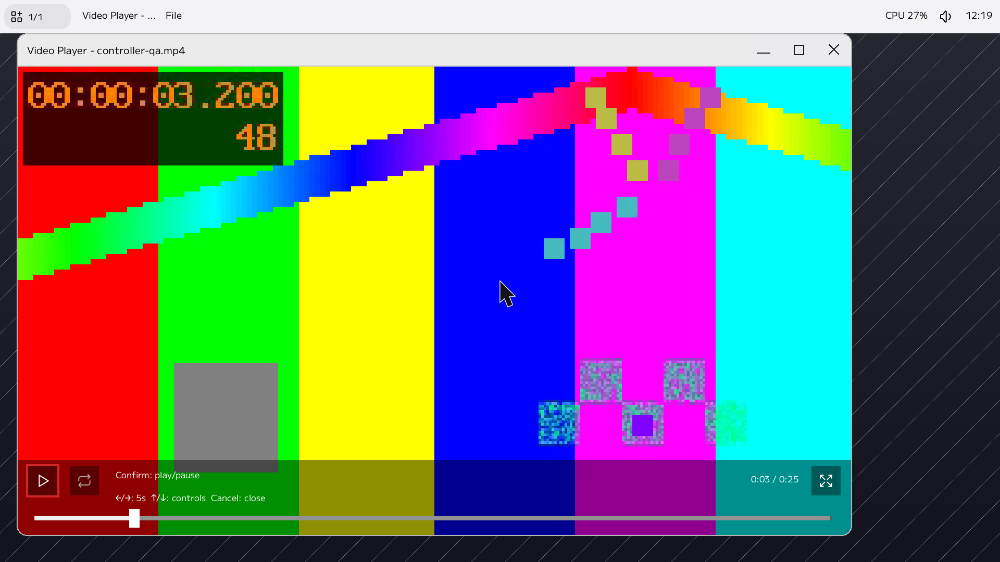
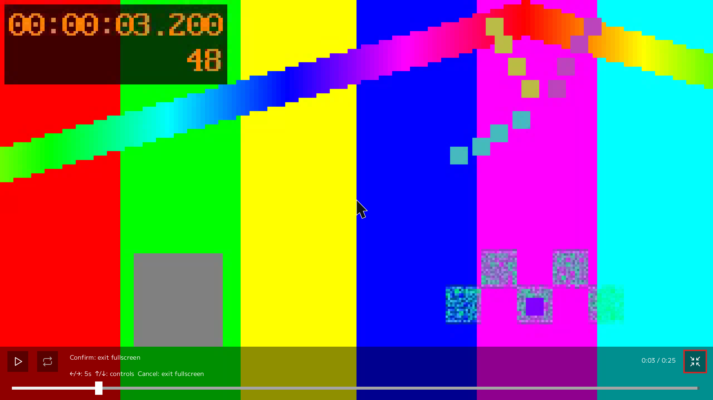
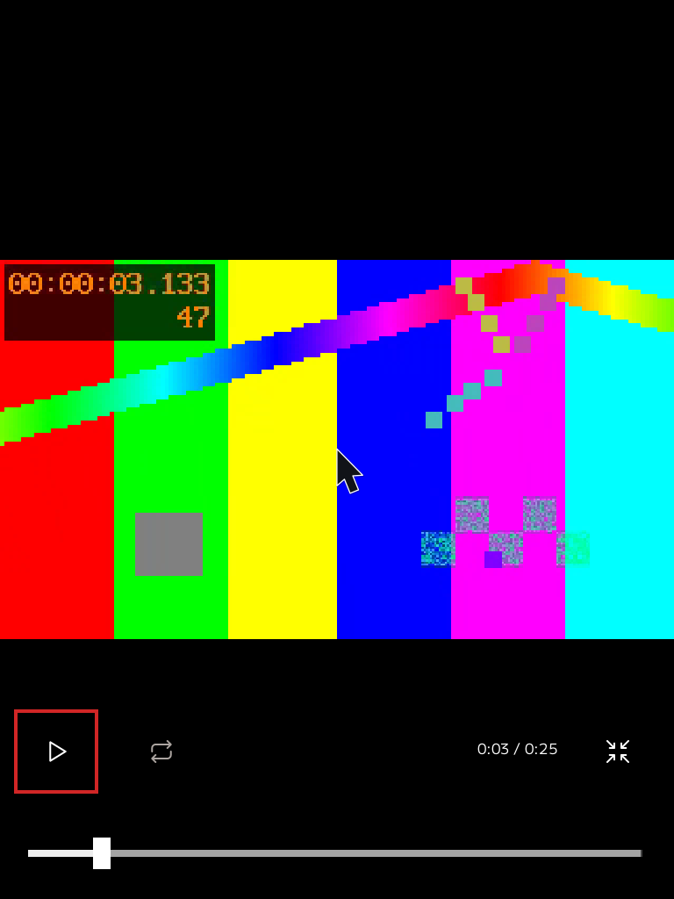

# VideoPlayer controls validation

The screenshots below are from the running Scarlet VM (CPU compositor,
VideoToolbox H.264/AAC decode), using a local test clip. Output density is 2;
Normal controls are 28 logical pixels and Tablet targets are 44 logical pixels.

## Normal and fullscreen

Fullscreen removes both the titlebar and desktop chrome. Cancel restores the
previous geometry and retains the paused frame and control focus. Confirm and
F11 are also available for switching; pointer activation uses the lower-right
native icon.

## Tablet portrait

Verified at 1920×1080 and 768×1024: fullscreen entry/exit, Normal/Tablet changes,
pause/resume, seek, and geometry/focus restoration. VM input was injected through
RFB; physical gamepad/touch and sensor rotation were not available. Audio decoding
was observed, but audible output and SGFX zero-copy presentation were not tested.

The host suite includes existing SharedU64 tests. It exercises
held keys, repeated/coalesced seeks, cancellation and resize during dragging,
control navigation, fullscreen request/confirmation/rejection, and centered
native icon masks at density 1 and 2. The original controls revision passed
target release builds.

OSD regression tests additionally cover idle hiding after controller input,
stationary mouse notifications, redundant fullscreen confirmations, native
touch reveal/dismiss and pause/resume, seek release/cancellation, resize during
touch, and secondary contacts. These tests use production input and timer
helpers with platform I/O stubbed; physical touch behavior remains unverified.
